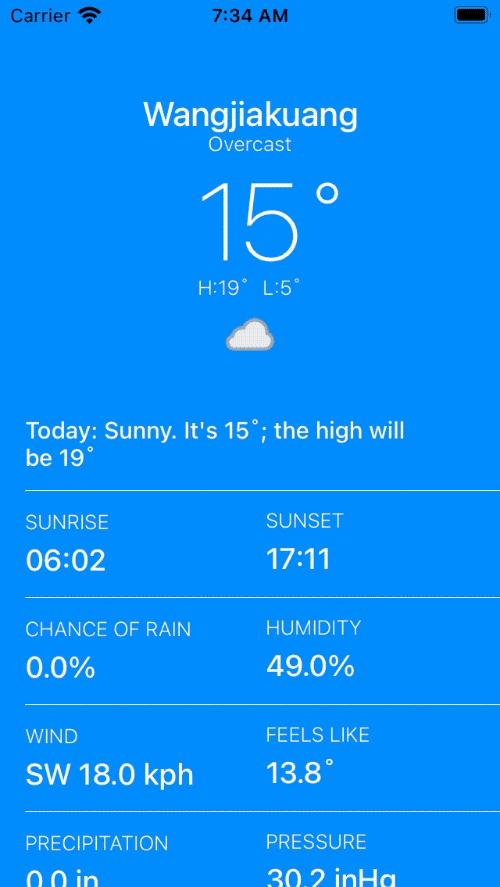
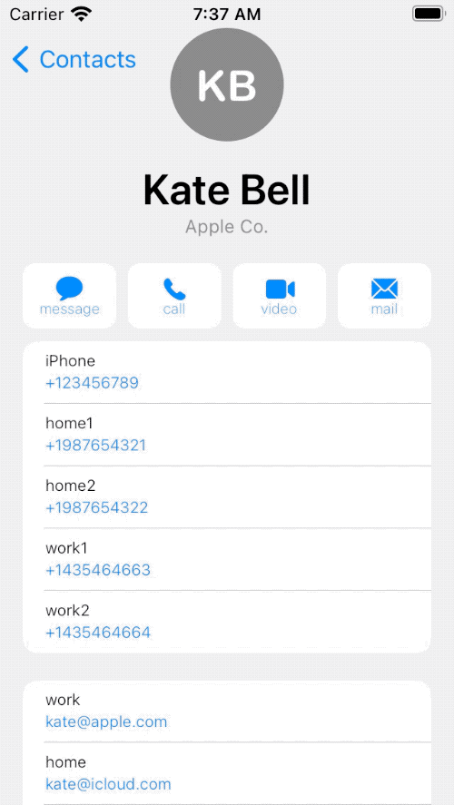

# FluentCollapsingHeaderView

#### A Collapse Header View like iOS Weather App

If you wonder how collapsing header view is implemented in **weather** and **contacts** detail in iOS, here is the answer. **FluentCollapsingHeaderView** gives you exactly the same behavior you see in those apps.

## Installation

### Swift Package Manager
Just add this repository link to Xcode add **Swift Package Manager** placeholder to add this framework to your project.

### Manually
Just copy all the files in **Source** folder into your project (Make sure target membership of files is checked as your project target)

## Usage

See examples

## Examples

There are two examples that show how to use **FluentCollapsingHeaderView**.

&mbsp;

## Credits

FluentCollapsingHeaderView is owned and maintained by the [Seyed Samad Gholamzadeh](http://ssamadgh@gmail.com). You can follow me on Twitter at [@ssamadgh](https://twitter.com/ssamadgh) for project updates and releases.

## License

FluentCollapsingHeaderView is released under the MIT license. [See LICENSE](./LICENSE) for details.
